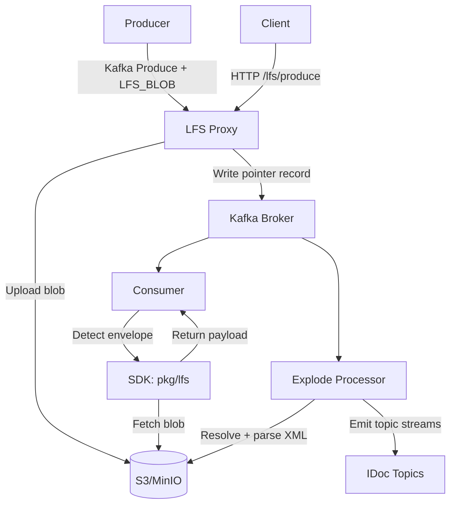
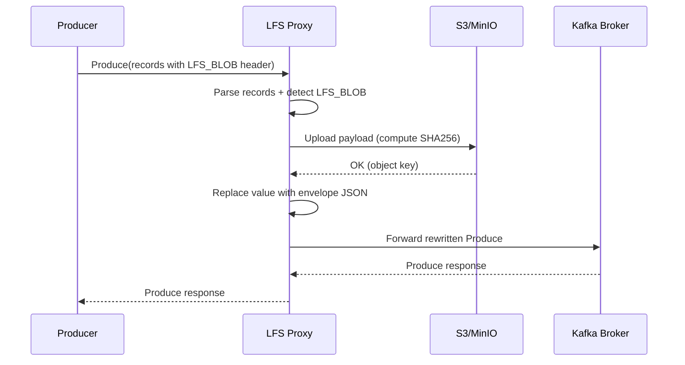
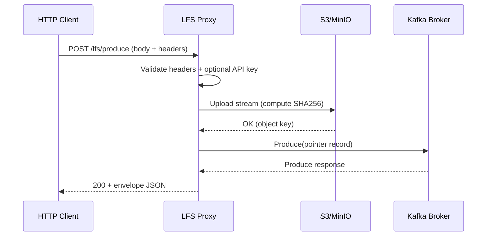
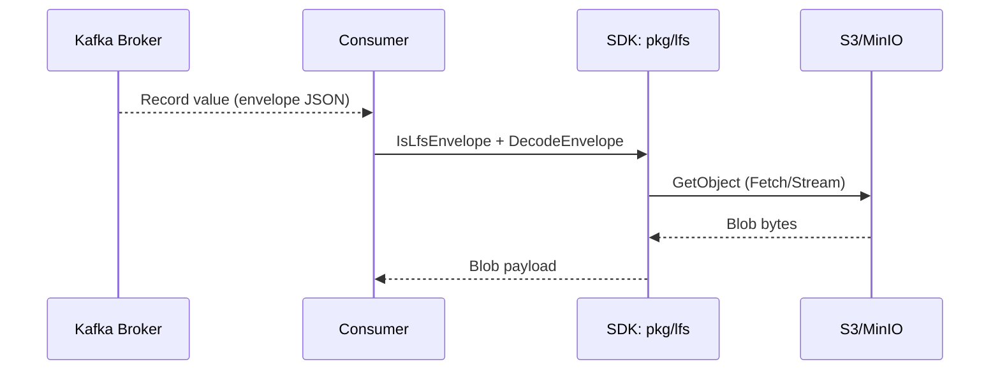

<!--
Copyright 2026 Alexander Alten (novatechflow), NovaTechflow (novatechflow.com).
This project is supported and financed by Scalytics, Inc. (www.scalytics.io).

Licensed under the Apache License, Version 2.0 (the "License");
you may not use this file except in compliance with the License.
You may obtain a copy of the License at

    http://www.apache.org/licenses/LICENSE-2.0

Unless required by applicable law or agreed to in writing, software
distributed under the License is distributed on an "AS IS" BASIS,
WITHOUT WARRANTIES OR CONDITIONS OF ANY KIND, either express or implied.
See the License for the specific language governing permissions and
limitations under the License.
-->

# LFS Proxy Data Flow (Write + Read)

This manual describes the end-to-end data flow for the LFS proxy: how large blobs are written to S3 and how consumers read them back. It covers the Kafka write path (LFS header rewrite), the HTTP write path, and the consumer read path.

## Components

- **LFS Proxy**: Kafka protocol proxy that rewrites records with `LFS_BLOB` headers into pointer envelopes and uploads payloads to S3.
- **S3-Compatible Storage**: AWS S3 or MinIO.
- **Kafka Broker**: Receives pointer records (JSON envelope).
- **Consumer SDK** (`pkg/lfs`): Detects envelopes and fetches objects from S3.
- **Explode Processor (LFS module)**: Resolves LFS envelopes and emits IDoc-derived topics.

## Object Key Format

Objects are stored with a predictable prefix:

```
<namespace>/<topic>/lfs/YYYY/MM/DD/obj-<uuid>
```

- `namespace` comes from `KAFSCALE_S3_NAMESPACE` (defaults to `default`).
- `topic` is the Kafka topic name.
- The timestamp is UTC.
- `<uuid>` is generated per object.

Implementation reference: `cmd/lfs-proxy/handler.go` (`buildObjectKey`).

## Write Path A: Kafka Produce With `LFS_BLOB` Header

This is the primary path when producers speak Kafka protocol directly.

1) **Client sends Kafka Produce**  
   A producer sends a Produce request containing records. Records intended for LFS include a header `LFS_BLOB` whose value is either:
   - empty string (no checksum enforcement), or
   - a hex SHA-256 checksum to validate the payload.
   Optionally, a `LFS_BLOB_ALG` header may specify the checksum algorithm (sha256/md5/crc32/none).

2) **Proxy accepts Kafka connection**  
   `lfs-proxy` listens on `KAFSCALE_LFS_PROXY_ADDR` (default `:9092`) and parses Kafka frames.  
   Implementation: `cmd/lfs-proxy/handler.go` (`listenAndServe`, `handleConnection`).

3) **Produce request is parsed**  
   The proxy parses the Produce request, locates records, and rewrites them.  
   Implementation: `cmd/lfs-proxy/handler.go` (`handleProduce`, `rewriteProduceRecords`).

4) **Record inspection and LFS detection**  
   Each record is scanned for a `LFS_BLOB` header. If missing, the record is passed through unchanged.  
   Implementation: `cmd/lfs-proxy/handler.go` (`rewriteProduceRecords`).

5) **Blob size enforcement**  
   The payload size is checked against `KAFSCALE_LFS_PROXY_MAX_BLOB_SIZE`. Oversized blobs are rejected.  
   Implementation: `cmd/lfs-proxy/handler.go`.

6) **Upload to S3**  
   The record value (payload) is uploaded to S3 using multipart upload if needed.  
   - S3 config: bucket, region, endpoint, credentials, path style  
   - SHA-256 is computed during upload.  
   Implementation: `cmd/lfs-proxy/s3.go` (`Upload`, `UploadStream`).

7) **Checksum validation (optional)**  
   If the `LFS_BLOB` header contains a checksum, it is compared to the computed SHA-256. Mismatches return an error.  
   Implementation: `cmd/lfs-proxy/handler.go`.

8) **Pointer envelope creation**  
   The record value is replaced with an LFS envelope JSON. Only allowlisted headers are preserved in `original_headers` to avoid leaking sensitive data:
   ```
   {
     "kfs_lfs": 1,
     "bucket": "...",
     "key": "...",
     "size": ...,
     "sha256": "...",
     "checksum": "...",
     "checksum_alg": "sha256",
     "content_type": "...",
     "original_headers": {...},
     "created_at": "...",
     "proxy_id": "..."
   }
   ```
   The `LFS_BLOB` header is removed.  
   Implementation: `pkg/lfs/envelope.go`, `cmd/lfs-proxy/handler.go`.

9) **Forward rewritten Produce to Kafka**  
   The proxy connects to a broker (`KAFSCALE_LFS_PROXY_BACKENDS` or metadata from etcd) and forwards the rewritten Produce request.  
   Implementation: `cmd/lfs-proxy/handler.go` (`connectBackend`, `forwardToBackend`).

10) **Metrics and orphan tracking**  
   The proxy records request metrics and upload bytes. If the broker connection fails after upload, it logs and counts orphaned objects.  
   Implementation: `cmd/lfs-proxy/metrics.go`, `cmd/lfs-proxy/handler.go` (`trackOrphans`).

Result: Kafka stores a **small pointer record** instead of the blob. The blob is stored in S3.

## Write Path B: HTTP `/lfs/produce`

This path is for clients that do not speak Kafka protocol.

1) **Client sends HTTP POST**  
   `POST /lfs/produce` with the blob as body and headers:
   - `X-Kafka-Topic` (required)
   - `X-Kafka-Key` (optional, base64)
   - `X-Kafka-Partition` (optional, int)
   - `X-LFS-Checksum` (optional, hex checksum)
   - `X-LFS-Checksum-Alg` (optional, checksum algorithm)

2) **Auth (optional)**  
   If `KAFSCALE_LFS_PROXY_HTTP_API_KEY` is set, the request must include `X-API-Key` or `Authorization: Bearer <key>`.  
   Implementation: `cmd/lfs-proxy/http.go`.

2a) **Topic validation**  
   The topic name is validated against `KAFSCALE_LFS_PROXY_TOPIC_MAX_LENGTH` and a safe character set before use in S3 keys.

3) **Upload to S3**  
   The body is streamed to S3 with size limits and SHA-256 computed.  
   Implementation: `cmd/lfs-proxy/http.go`, `cmd/lfs-proxy/s3.go`.

4) **Create envelope and produce to Kafka**  
   A single-record Produce request is built and forwarded to the backend broker.  
   Implementation: `cmd/lfs-proxy/http.go`, `cmd/lfs-proxy/record.go`.

Result: Same envelope format as Kafka path; blob stored in S3.

## Read Path (Consumer)

Consumers can detect and hydrate LFS records using `pkg/lfs`.

1) **Consume Kafka records**  
   The consumer receives messages from Kafka as usual.

2) **Detect LFS envelope**  
   Call `lfs.IsLfsEnvelope(value)` to detect LFS records (quick JSON marker check).  
   Implementation: `pkg/lfs/envelope.go`.

3) **Decode envelope**  
   Use `lfs.DecodeEnvelope(value)` to parse fields and validate required fields.  
   Implementation: `pkg/lfs/envelope.go`.

4) **Fetch blob from S3**  
   Use `lfs.NewS3Client` with S3 config and call:
   - `Fetch(ctx, key)` to read all bytes, or
   - `Stream(ctx, key)` to get an `io.ReadCloser` + content length.
   Implementation: `pkg/lfs/s3client.go`.

5) **Verify checksum (recommended)**  
   Compare the retrieved bytes to `env.SHA256` or to `env.Checksum` based on `env.ChecksumAlg` (planned).  
   The SDK does not automatically verify; callers should enforce integrity.

Result: The consumer gets the original blob payload.

## Failure Modes and Signals

- **Upload errors**: The proxy increments `kafscale_lfs_proxy_s3_errors_total` and returns errors to the client.
- **Checksum mismatch**: The proxy returns an error and attempts to delete the uploaded object. If delete fails, it is tracked as an orphan.
- **Backend failures**: Uploaded objects are tracked as orphans when produce forwarding fails.
- **Metrics**: `kafscale_lfs_proxy_requests_total{topic,status,type}` and upload duration/bytes report LFS activity.

## Quick Reference: Environment Variables

- **Proxy**
  - `KAFSCALE_LFS_PROXY_ADDR` (Kafka listener)
  - `KAFSCALE_LFS_PROXY_HTTP_ADDR` (HTTP listener)
  - `KAFSCALE_LFS_PROXY_HTTP_API_KEY` (optional)
  - `KAFSCALE_LFS_PROXY_HTTP_READ_TIMEOUT_SEC`
  - `KAFSCALE_LFS_PROXY_HTTP_WRITE_TIMEOUT_SEC`
  - `KAFSCALE_LFS_PROXY_HTTP_IDLE_TIMEOUT_SEC`
  - `KAFSCALE_LFS_PROXY_HTTP_HEADER_TIMEOUT_SEC`
  - `KAFSCALE_LFS_PROXY_HTTP_MAX_HEADER_BYTES`
  - `KAFSCALE_LFS_PROXY_HTTP_SHUTDOWN_TIMEOUT_SEC`
  - `KAFSCALE_LFS_PROXY_HTTP_TLS_ENABLED`
  - `KAFSCALE_LFS_PROXY_HTTP_TLS_CERT_FILE`
  - `KAFSCALE_LFS_PROXY_HTTP_TLS_KEY_FILE`
  - `KAFSCALE_LFS_PROXY_HTTP_TLS_CLIENT_CA_FILE`
  - `KAFSCALE_LFS_PROXY_HTTP_TLS_REQUIRE_CLIENT_CERT`
  - `KAFSCALE_LFS_PROXY_BACKENDS` (broker list)
  - `KAFSCALE_LFS_PROXY_BACKEND_TLS_ENABLED`
  - `KAFSCALE_LFS_PROXY_BACKEND_TLS_CA_FILE`
  - `KAFSCALE_LFS_PROXY_BACKEND_TLS_CERT_FILE`
  - `KAFSCALE_LFS_PROXY_BACKEND_TLS_KEY_FILE`
  - `KAFSCALE_LFS_PROXY_BACKEND_TLS_SERVER_NAME`
  - `KAFSCALE_LFS_PROXY_BACKEND_TLS_INSECURE_SKIP_VERIFY`
  - `KAFSCALE_LFS_PROXY_BACKEND_SASL_MECHANISM`
  - `KAFSCALE_LFS_PROXY_BACKEND_SASL_USERNAME`
  - `KAFSCALE_LFS_PROXY_BACKEND_SASL_PASSWORD`
  - `KAFSCALE_LFS_PROXY_BACKEND_RETRIES`
  - `KAFSCALE_LFS_PROXY_BACKEND_BACKOFF_MS`
  - `KAFSCALE_LFS_PROXY_BACKEND_REFRESH_INTERVAL_SEC`
  - `KAFSCALE_LFS_PROXY_BACKEND_CACHE_TTL_SEC`
  - `KAFSCALE_LFS_PROXY_DIAL_TIMEOUT_MS`
  - `KAFSCALE_LFS_PROXY_ETCD_ENDPOINTS` (metadata store)
  - `KAFSCALE_LFS_PROXY_ETCD_USERNAME`
  - `KAFSCALE_LFS_PROXY_ETCD_PASSWORD`
  - `KAFSCALE_LFS_PROXY_S3_*` (bucket/region/endpoint/credentials)
  - `KAFSCALE_LFS_PROXY_S3_HEALTH_INTERVAL_SEC`
  - `KAFSCALE_LFS_PROXY_MAX_BLOB_SIZE`
  - `KAFSCALE_LFS_PROXY_CHUNK_SIZE`
  - `KAFSCALE_S3_NAMESPACE`
  - `KAFSCALE_LFS_PROXY_TOPIC_MAX_LENGTH`
  - `KAFSCALE_LFS_PROXY_CHECKSUM_ALGO` (default sha256)

## Checksum Algorithm Options

### Why configurable checksums

Configurable checksums let you trade off integrity guarantees vs. CPU cost based on workload:

- **sha256**: strongest integrity; recommended default for security-sensitive data.
- **md5**: faster and widely supported; useful for legacy systems or interoperability.
- **crc32**: very fast corruption detection for high-throughput pipelines.
- **none**: skips checksum validation when the transport/storage already guarantees integrity.

The proxy keeps SHA-256 as the default and preserves backward compatibility by retaining the `sha256` field in envelopes.

- **Kafka header**: `LFS_BLOB_ALG` (optional)
- **HTTP header**: `X-LFS-Checksum-Alg` (optional)
- **Envelope fields**: `checksum_alg`, `checksum` (with `sha256` preserved for compatibility)


## Backend TLS/SASL

The proxy can secure backend broker connections with TLS and SASL/PLAIN.
Configure via `KAFSCALE_LFS_PROXY_BACKEND_TLS_*` and `KAFSCALE_LFS_PROXY_BACKEND_SASL_*` env vars.

## HTTP TLS Example

Enable HTTP TLS by setting:

- `KAFSCALE_LFS_PROXY_HTTP_TLS_ENABLED=true`
- `KAFSCALE_LFS_PROXY_HTTP_TLS_CERT_FILE=/path/to/tls.crt`
- `KAFSCALE_LFS_PROXY_HTTP_TLS_KEY_FILE=/path/to/tls.key`

Optional mTLS:
- `KAFSCALE_LFS_PROXY_HTTP_TLS_CLIENT_CA_FILE=/path/to/ca.crt`
- `KAFSCALE_LFS_PROXY_HTTP_TLS_REQUIRE_CLIENT_CERT=true`

## Explode Processor (LFS Module)

The IDoc exploder is part of the LFS module and uses `pkg/lfs` to resolve envelopes. It parses XML and publishes
structured topic streams (headers/items/partners/status/dates/segments) for analytics and correlation.

## End-to-End Summary

- Producers send large data with `LFS_BLOB` header or via HTTP.
- LFS proxy stores the blob in S3 and replaces the record value with a compact JSON pointer.
- Consumers detect pointer envelopes, fetch from S3, and verify integrity.

## Flow Chart (Write + Read)



## Sequence Diagram (Kafka Write Path)



## Sequence Diagram (HTTP Write Path)



## Sequence Diagram (Read Path)


