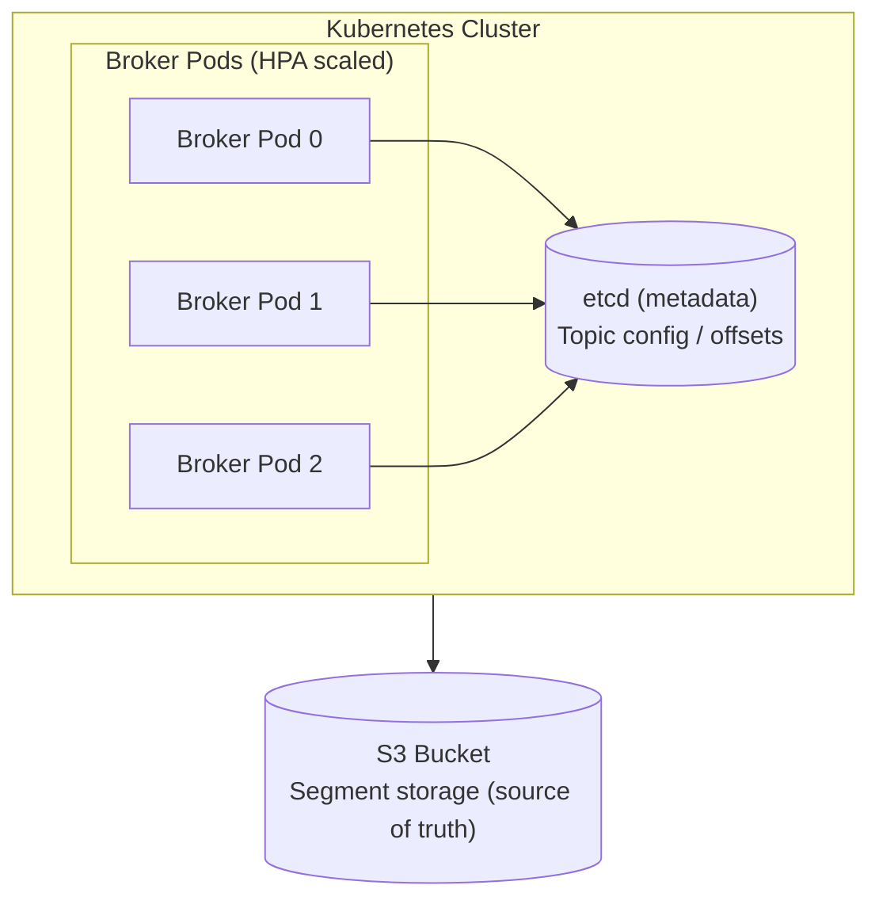
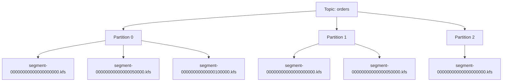

# Kafscale: S3-Backed Kafka-Compatible Streaming Platform

A Kubernetes-native, S3-backed message streaming system implementing the Kafka protocol for the 80% of use cases that need durable message delivery without operational complexity.

## Project Philosophy

Most Kafka deployments serve as durable pipes moving data from point A to points B through N. They don't require sub-millisecond latency, exactly-once transactions, or compacted topics. They need: messages in, messages out, consumer tracking, and the confidence that data won't be lost.

Kafscale trades latency for operational simplicity. Brokers are stateless. S3 is the source of truth. Kubernetes handles scaling and failover. The result: a system that scales to zero when idle and requires no dedicated ops expertise.

Kafscale deliberately focuses on durable message transport only. There is no built-in stream-processing runtime; teams should continue to pair the platform with engines such as Apache Flink, Wayang, or any other compute stack that reads from Kafka topics. Keeping processing concerns out of the broker keeps the surface area small and lets us optimize for throughput + durability while reusing the rich processing ecosystem that already speaks Kafka.

---

## Architecture Overview



### Component Responsibilities

**Broker Pods**: Accept Kafka protocol connections, buffer writes, flush segments to S3, serve reads from S3 (with caching), coordinate consumer groups.

**etcd**: Store topic/partition metadata, consumer group offsets, partition-to-broker assignments. Leverages existing K8s etcd or dedicated cluster.

**S3**: Immutable segment storage. All message data lives here. Brokers have no local persistent state.

### S3 Configuration

- **Bucket naming**: `kafscale-{environment}-{region}` (e.g. `kafscale-prod-us-east-1`). Each environment gets a dedicated bucket to isolate retention policies and IAM permissions.
- **Region / AZ affinity**: The bucket region must match the Kubernetes cluster’s region to avoid cross-region bandwidth charges. Operators can optionally enable S3 Multi-AZ (S3 Standard) or Cross-Region Replication for DR via CRD flags.
- **Namespace layout**: `{bucket}/{namespace}/{topic}/{partition}/segment-{base_offset}.kfs` as described later in the Data Model.
- **Encryption**: All objects use SSE-KMS with a customer-managed CMK (provided in cluster spec). If no CMK is provided, default to SSE-S3 but emit a warning.
- **Lifecycle**: Retention policies are applied at the bucket level based on topic-level TTL (operator maintains prefix-specific lifecycle rules to avoid global deletes).

The Kubernetes operator manages S3 buckets when requested (via IAM credentials with `s3:CreateBucket`). In managed environments the bucket may already exist; the CRD allows referencing existing buckets by ARN/name.

### Secret & Configuration Store

- **KafscaleCluster CRD**: Gains an `s3` stanza with `bucket`, `region`, `endpoint`, `kmsKeyArn`, `replication` (bool), and `credentialsSecretRef`.
- **Credentials**: Access key / secret, session token, and optional STS role are stored in a Kubernetes `Secret` (type `Opaque`). Users are expected to provision it via Sealed Secrets, External Secrets, or KMS-backed CSI so data at rest remains encrypted.
- **Operator behavior**:
  - Reads the secret, mounts credentials into broker pods via projected volume/env vars.
  - Rotates credentials by watching the secret; restarts pods when data changes.
  - Validates bucket access (list bucket) before reconciling brokers.
- **In-broker config**: The broker config (`/etc/kafscale/broker.yaml`) includes:
  ```yaml
  s3:
    bucket: "kafscale-prod-us-east-1"
    region: "us-east-1"
    endpoint: ""            # optional custom endpoint (MinIO, VPC)
    kmsKeyArn: "arn:aws:kms:..."
    roleArn: ""             # optional assume-role
    credentialSource: "env" # env, iam, workload-identity
  ```

Secrets are never written to etcd; only the operator and pods with the `kafscale-broker` ServiceAccount can read them. All restarts go through the BrokerControl drain RPC to avoid data loss.

---

## Data Model

### Topics and Partitions



### S3 Key Structure

```
s3://{bucket}/{namespace}/{topic}/{partition}/segment-{base_offset}.kfs
s3://{bucket}/{namespace}/{topic}/{partition}/segment-{base_offset}.index
```

Example:
```
s3://kafscale-data/production/orders/0/segment-00000000000000000000.kfs
s3://kafscale-data/production/orders/0/segment-00000000000000000000.index
```

### Segment File Format

Each segment is a self-contained file with messages and metadata:

```
┌────────────────────────────────────────────────────────────────┐
│ Segment Header (32 bytes)                                      │
├────────────────────────────────────────────────────────────────┤
│ Magic Number        │ 4 bytes  │ 0x4B414653 ("KAFS")           │
│ Version             │ 2 bytes  │ Format version (1)            │
│ Flags               │ 2 bytes  │ Compression, etc.             │
│ Base Offset         │ 8 bytes  │ First offset in segment       │
│ Message Count       │ 4 bytes  │ Number of messages            │
│ Created Timestamp   │ 8 bytes  │ Unix millis                   │
│ Reserved            │ 4 bytes  │ Future use                    │
├────────────────────────────────────────────────────────────────┤
│ Message Batch 1                                                │
├────────────────────────────────────────────────────────────────┤
│ Message Batch 2                                                │
├────────────────────────────────────────────────────────────────┤
│ ...                                                            │
├────────────────────────────────────────────────────────────────┤
│ Segment Footer (16 bytes)                                      │
├────────────────────────────────────────────────────────────────┤
│ CRC32               │ 4 bytes  │ Checksum of all batches       │
│ Last Offset         │ 8 bytes  │ Last offset in segment        │
│ Footer Magic        │ 4 bytes  │ 0x454E4421 ("END!")           │
└────────────────────────────────────────────────────────────────┘
```

### Message Batch Format

Messages are grouped into batches for efficiency:

```
┌────────────────────────────────────────────────────────────────┐
│ Batch Header (49 bytes)                                        │
├────────────────────────────────────────────────────────────────┤
│ Base Offset         │ 8 bytes  │ First offset in batch         │
│ Batch Length        │ 4 bytes  │ Total bytes in batch          │
│ Partition Leader    │ 4 bytes  │ Epoch of leader               │
│ Magic               │ 1 byte   │ 2 (Kafka compat)              │
│ CRC32               │ 4 bytes  │ Checksum of batch             │
│ Attributes          │ 2 bytes  │ Compression, timestamp type   │
│ Last Offset Delta   │ 4 bytes  │ Offset of last msg - base     │
│ First Timestamp     │ 8 bytes  │ Timestamp of first message    │
│ Max Timestamp       │ 8 bytes  │ Max timestamp in batch        │
│ Producer ID         │ 8 bytes  │ -1 (no idempotence)           │
│ Producer Epoch      │ 2 bytes  │ -1                            │
│ Base Sequence       │ 4 bytes  │ -1                            │
│ Record Count        │ 4 bytes  │ Number of records in batch    │
├────────────────────────────────────────────────────────────────┤
│ Record 1                                                       │
│ Record 2                                                       │
│ ...                                                            │
└────────────────────────────────────────────────────────────────┘
```

### Individual Record Format

```
┌────────────────────────────────────────────────────────────────┐
│ Length              │ varint   │ Total record size             │
│ Attributes          │ 1 byte   │ Unused (0)                    │
│ Timestamp Delta     │ varint   │ Delta from batch timestamp    │
│ Offset Delta        │ varint   │ Delta from batch base offset  │
│ Key Length          │ varint   │ -1 for null, else byte count  │
│ Key                 │ bytes    │ Message key (optional)        │
│ Value Length        │ varint   │ Message value byte count      │
│ Value               │ bytes    │ Message payload               │
│ Headers Count       │ varint   │ Number of headers             │
│ Headers             │ bytes    │ Key-value header pairs        │
└────────────────────────────────────────────────────────────────┘
```

### Index File Format

Sparse index for offset-to-position lookups:

```
┌────────────────────────────────────────────────────────────────┐
│ Index Header (16 bytes)                                        │
├────────────────────────────────────────────────────────────────┤
│ Magic               │ 4 bytes  │ 0x494458 ("IDX")              │
│ Version             │ 2 bytes  │ 1                             │
│ Entry Count         │ 4 bytes  │ Number of index entries       │
│ Interval            │ 4 bytes  │ Messages between entries      │
│ Reserved            │ 2 bytes  │ Future use                    │
├────────────────────────────────────────────────────────────────┤
│ Entry 1: Offset (8 bytes) + Position (4 bytes)                 │
│ Entry 2: Offset (8 bytes) + Position (4 bytes)                 │
│ ...                                                            │
└────────────────────────────────────────────────────────────────┘
```

---

## etcd Data Schema

All metadata persisted in etcd is encoded as versioned Protobuf messages (stored as binary) to give us forward/backward compatibility and avoid ad-hoc JSON migrations. The `.proto` files live under `proto/metadata/*.proto` and are referenced both by the brokers and the Kubernetes operator.

```
// proto/metadata/topic.proto
syntax = "proto3";
package kafscale.metadata;

message TopicConfig {
  string name = 1;
  int32 partitions = 2;
  int32 replication_factor = 3;
  int64 retention_ms = 4;
  int64 retention_bytes = 5;
  int64 segment_bytes = 6;
  string created_at = 7;
  map<string, string> config = 8;
}

message PartitionState {
  string topic = 1;
  int32 partition = 2;
  string leader_broker = 3;
  int32 leader_epoch = 4;
  int64 log_start_offset = 5;
  int64 log_end_offset = 6;
  int64 high_watermark = 7;
  string active_segment = 8;
  repeated SegmentInfo segments = 9;
}

message SegmentInfo {
  int64 base_offset = 1;
  int64 size_bytes = 2;
  string created_at = 3;
}

message ConsumerGroup {
  string group_id = 1;
  string state = 2;
  string protocol_type = 3;
  string protocol = 4;
  string leader = 5;
  int32 generation_id = 6;
  map<string, GroupMember> members = 7;
}

message GroupMember {
  string client_id = 1;
  string client_host = 2;
  string heartbeat_at = 3;
  repeated Assignment assignments = 4;
  repeated string subscriptions = 5;
}

message Assignment {
  string topic = 1;
  repeated int32 partitions = 2;
}

message CommittedOffset {
  int64 offset = 1;
  string metadata = 2;
  string committed_at = 3;
  int32 leader_epoch = 4;
}

message BrokerRegistration {
  string broker_id = 1;
  string host = 2;
  int32 port = 3;
  string rack = 4;
  string started_at = 5;
  string last_heartbeat = 6;
  string version = 7;
}

message PartitionAssignment {
  string broker_id = 1;
  int32 epoch = 2;
  string assigned_at = 3;
}
```

For readability the examples below keep using JSON, but treat them as the JSON form of the protobuf messages above.

### Topic Configuration

```
Key:   /kafscale/topics/{topic}/config
Value: {
  "name": "orders",
  "partitions": 6,
  "replication_factor": 1,  // Always 1, S3 handles durability
  "retention_ms": 604800000,  // 7 days
  "retention_bytes": -1,  // Unlimited
  "segment_bytes": 104857600,  // 100MB
  "created_at": "2024-01-15T10:30:00Z",
  "config": {
    "compression.type": "snappy",
    "cleanup.policy": "delete"
  }
}
```

### Partition State

```
Key:   /kafscale/topics/{topic}/partitions/{partition}
Value: {
  "topic": "orders",
  "partition": 0,
  "leader_broker": "broker-2",
  "leader_epoch": 15,
  "log_start_offset": 0,
  "log_end_offset": 150000,
  "high_watermark": 149500,
  "active_segment": "segment-00000000000000100000.kfs",
  "segments": [
    {"base_offset": 0, "size_bytes": 104857600, "created_at": "..."},
    {"base_offset": 50000, "size_bytes": 104857600, "created_at": "..."},
    {"base_offset": 100000, "size_bytes": 52428800, "created_at": "..."}
  ]
}
```

### Consumer Group State

```
Key:   /kafscale/consumers/{group_id}/metadata
Value: {
  "group_id": "order-processor",
  "state": "Stable",  // Empty, PreparingRebalance, CompletingRebalance, Stable, Dead
  "protocol_type": "consumer",
  "protocol": "range",
  "leader": "consumer-abc-123",
  "generation_id": 42,
  "members": {
    "consumer-abc-123": {
      "client_id": "order-service-1",
      "client_host": "10.0.1.15",
      "heartbeat_at": "2024-01-15T10:30:00Z",
      "assignment": [
        {"topic": "orders", "partitions": [0, 1, 2]}
      ],
      "subscriptions": ["orders", "payments"]
    },
    "consumer-def-456": {
      "client_id": "order-service-2",
      "client_host": "10.0.1.16",
      "heartbeat_at": "2024-01-15T10:30:01Z",
      "assignment": [
        {"topic": "orders", "partitions": [3, 4, 5]}
      ],
      "subscriptions": ["orders", "payments"]
    }
  }
}
```

### Consumer Offsets

```
Key:   /kafscale/consumers/{group_id}/offsets/{topic}/{partition}
Value: {
  "offset": 145000,
  "metadata": "",
  "committed_at": "2024-01-15T10:29:55Z",
  "leader_epoch": 15
}
```

### Broker Registration

```
Key:   /kafscale/brokers/{broker_id}
Value: {
  "broker_id": "broker-2",
  "host": "kafscale-broker-2.kafscale.svc.cluster.local",
  "port": 9092,
  "rack": "zone-a",
  "started_at": "2024-01-15T08:00:00Z",
  "last_heartbeat": "2024-01-15T10:30:05Z",
  "version": "0.1.0"
}

TTL: 30 seconds (auto-removed if broker dies)
```

### Partition Leadership

```
Key:   /kafscale/assignments/{topic}/{partition}
Value: {
  "broker_id": "broker-2",
  "epoch": 15,
  "assigned_at": "2024-01-15T09:15:00Z"
}
```

### Metadata Snapshot

```
Key:   /kafscale/metadata/snapshot
Value: {
  "controller_id": 1,
  "cluster_id": "kafscale-prod",
  "brokers": [...],
  "topics": [...]
}
```

The operator periodically writes the full cluster metadata (JSON mirroring `ClusterMetadata`). Brokers watch this key and refresh their in-memory view whenever it changes, ensuring topic creations and partition reassignments propagate without restarting pods.

---

## Broker Architecture

### Process Structure

```mermaid
flowchart LR
    C[Client (TCP)] --> NL[Network Layer\nKafka protocol handlers]
    NL --> RR[Request Router\n(Metadata / Produce / Fetch)]
    RR --> WP[Write Path]
    RR --> RP[Read Path]

    subgraph "Write Path"
        WB["Per-partition Write Buffer"] --> SB["Segment Builder"]
        SB --> S3Write[("S3 Bucket\nWrite")]
    end

    subgraph "Read Path"
        SC["Segment Cache"] --> SR["S3 Reader"]
        SR --> S3Read[("S3 Bucket\nRead")]
    end
```

### Goroutine Model

```go
// Main goroutine structure per broker

func main() {
    // 1. Coordinator goroutines (few, long-lived)
    go etcdWatcher()           // Watch for metadata changes
    go partitionAssigner()     // Handle leadership assignments
    go segmentFlusher()        // Background segment uploads
    go consumerGroupManager()  // Manage group coordination

    // 2. Per-connection goroutines (many, connection-scoped)
    for conn := range listener.Accept() {
        go handleConnection(conn)  // Each client gets a goroutine
    }

    // 3. Per-partition goroutines (moderate count)
    for _, partition := range assignedPartitions {
        go partitionWriter(partition)  // Handles write buffering
        go partitionReader(partition)  // Handles fetch requests
    }
}
```

### Internal Control Plane RPCs

Every broker exposes a gRPC server (HTTP/2 on the metrics port) that implements a set of protobuf-defined control plane APIs. For example, the Kubernetes operator dials `BrokerControl` to drain partitions before a rollout, to trigger manual segment flushes, or to fetch broker health without scraping logs. Additional streaming APIs push high-frequency stats back to the operator so dashboards can be populated even when Prometheus scrapes lag.

```
// proto/control/broker.proto
syntax = "proto3";
package kafscale.control;

service BrokerControl {
  rpc GetStatus(BrokerStatusRequest) returns (BrokerStatusResponse);
  rpc DrainPartitions(DrainPartitionsRequest) returns (DrainPartitionsResponse);
  rpc TriggerFlush(TriggerFlushRequest) returns (TriggerFlushResponse);
  rpc StreamMetrics(stream MetricsSample) returns Ack; // broker pushes samples
}

service AssignmentStream {
  rpc WatchAssignments(AssignmentWatchRequest)
      returns (stream PartitionAssignmentEvent); // operator -> broker
}
```

The protobuf definitions are shared with the operator and with any future automation tools; code is generated via `buf` or `protoc` as part of `make generate`. Brokers keep using the Kafka wire protocol for client traffic, but everything inside the control plane (operator ↔ broker, broker ↔ tests, tooling) relies on protobuf messages so the payloads stay small and versionable.

### Write Path Detail

```
Producer Request
       │
       ▼
┌──────────────────────────────────────────────────────────────────┐
│ 1. RECEIVE                                                       │
│    - Parse ProduceRequest                                        │
│    - Validate topic exists                                       │
│    - Check this broker owns partition                            │
└───────────────────────────────┬──────────────────────────────────┘
                                │
                                ▼
┌──────────────────────────────────────────────────────────────────┐
│ 2. BUFFER                                                        │
│    - Append to partition's in-memory write buffer                │
│    - Assign offsets (atomic increment from etcd high watermark)  │
│    - Start ack timer if acks=1                                   │
└───────────────────────────────┬──────────────────────────────────┘
                                │
                                ▼
┌──────────────────────────────────────────────────────────────────┐
│ 3. FLUSH DECISION                                                │
│    Check if flush needed:                                        │
│    - Buffer size >= segment_buffer_bytes (default 4MB)           │
│    - Time since last flush >= flush_interval_ms (default 500ms)  │
│    - Explicit flush request                                      │
└───────────────────────────────┬──────────────────────────────────┘
                                │
               ┌────────────────┴────────────────┐
               │ Flush Triggered                 │ No Flush Yet
               ▼                                 ▼
┌─────────────────────────────────┐   ┌─────────────────────────────┐
│ 4. BUILD SEGMENT                │   │ Return to Producer          │
│    - Compress batches (snappy)  │   │ (acks=0: immediate)         │
│    - Build segment header/footer│   │ (acks=1: after buffer)      │
│    - Calculate CRC              │   └─────────────────────────────┘
│    - Build sparse index         │
└───────────────────┬─────────────┘
                    │
                    ▼
┌──────────────────────────────────────────────────────────────────┐
│ 5. S3 UPLOAD                                                     │
│    - Upload segment file (PutObject)                             │
│    - Upload index file (PutObject)                               │
│    - Both uploads must succeed                                   │
└───────────────────────────────┬──────────────────────────────────┘
                                │
                                ▼
┌──────────────────────────────────────────────────────────────────┐
│ 6. COMMIT                                                        │
│    - Update etcd partition state (high watermark, segment list)  │
│    - Clear flushed data from write buffer                        │
│    - Ack waiting producers (acks=all)                            │
└──────────────────────────────────────────────────────────────────┘
```

### Read Path Detail

```
Fetch Request
       │
       ▼
┌──────────────────────────────────────────────────────────────────┐
│ 1. RECEIVE                                                       │
│    - Parse FetchRequest                                          │
│    - Extract: topic, partition, fetch_offset, max_bytes          │
└───────────────────────────────┬──────────────────────────────────┘
                                │
                                ▼
┌──────────────────────────────────────────────────────────────────┐
│ 2. LOCATE SEGMENT                                                │
│    - Load partition metadata from etcd (cached)                  │
│    - Binary search segments to find segment containing offset    │
│    - Calculate S3 key for segment and index                      │
└───────────────────────────────┬──────────────────────────────────┘
                                │
                                ▼
┌──────────────────────────────────────────────────────────────────┐
│ 3. CHECK CACHE                                                   │
│    - Check if segment in local LRU cache                         │
│    - Check if requested range is in read-ahead buffer            │
└───────────────────────────────┬──────────────────────────────────┘
                                │
               ┌────────────────┴────────────────┐
               │ Cache Hit                       │ Cache Miss
               ▼                                 ▼
┌─────────────────────────────────┐   ┌─────────────────────────────┐
│ 4a. SERVE FROM CACHE            │   │ 4b. FETCH FROM S3           │
│     - Read from memory          │   │     - Load index file       │
│     - Skip to step 6            │   │     - Find position in index│
└─────────────────────────────────┘   │     - Range GET from S3     │
                                      │     - Populate cache        │
                                      │     - Trigger read-ahead    │
                                      └──────────────┬──────────────┘
                                                     │
                                ┌────────────────────┘
                                │
                                ▼
┌──────────────────────────────────────────────────────────────────┐
│ 5. CHECK UNFLUSHED BUFFER                                        │
│    - If fetch_offset > flushed_offset, also include buffered data│
│    - Merge buffered records with segment data                    │
└───────────────────────────────┬──────────────────────────────────┘
                                │
                                ▼
┌──────────────────────────────────────────────────────────────────┐
│ 6. BUILD RESPONSE                                                │
│    - Assemble FetchResponse with record batches                  │
│    - Include high watermark for consumer lag calculation         │
│    - Respect max_bytes limit                                     │
└───────────────────────────────┬──────────────────────────────────┘
                                │
                                ▼
                          Return to Consumer
```

---

## Kafka Protocol Implementation

### Supported API Keys

| API Key | Name | Version | Status | Notes |
|---------|------|---------|--------|-------|
| 0 | Produce | 0-9 | Full | Core functionality |
| 1 | Fetch | 0-13 | Full | Core functionality |
| 2 | ListOffsets | 0-7 | Full | Required for consumers |
| 3 | Metadata | 0-12 | Full | Topic/broker discovery |
| 8 | OffsetCommit | 0-8 | Full | Consumer group tracking |
| 9 | OffsetFetch | 0-8 | Full | Consumer group tracking |
| 10 | FindCoordinator | 0-4 | Full | Group coordinator lookup |
| 11 | JoinGroup | 0-9 | Full | Consumer group membership |
| 12 | Heartbeat | 0-4 | Full | Consumer liveness |
| 13 | LeaveGroup | 0-5 | Full | Graceful consumer shutdown |
| 14 | SyncGroup | 0-5 | Full | Partition assignment |
| 18 | ApiVersions | 0-3 | Full | Client capability negotiation |
| 19 | CreateTopics | 0-7 | Full | Topic management |
| 20 | DeleteTopics | 0-6 | Full | Topic management |
| 32 | DescribeConfigs | 0-4 | Partial | Read-only config access |
| 42 | DeleteGroups | 0-2 | Full | Consumer group cleanup |

### Explicitly Unsupported (v1.0)

| API Key | Name | Reason |
|---------|------|--------|
| 4 | LeaderAndIsr | Internal Kafka protocol, not client-facing |
| 5 | StopReplica | No replication (S3 handles durability) |
| 6 | UpdateMetadata | Internal Kafka protocol |
| 7 | ControlledShutdown | Kubernetes handles pod lifecycle |
| 15 | DescribeGroups | Can add later if needed |
| 16 | ListGroups | Can add later if needed |
| 21 | DeleteRecords | S3 lifecycle handles retention |
| 22 | InitProducerId | Transactions not supported |
| 24 | AddPartitionsToTxn | Transactions not supported |
| 25 | AddOffsetsToTxn | Transactions not supported |
| 26 | EndTxn | Transactions not supported |
| 37 | CreatePartitions | Partition count is immutable initially |

### Request/Response Flow

```go
// Kafka protocol frame structure
type RequestHeader struct {
    APIKey        int16
    APIVersion    int16
    CorrelationID int32
    ClientID      string  // nullable
}

type ResponseHeader struct {
    CorrelationID int32
}

// Connection handling pseudocode
func handleConnection(conn net.Conn) {
    reader := bufio.NewReader(conn)
    writer := bufio.NewWriter(conn)

    for {
        // Read frame length (4 bytes, big endian)
        frameLen := readInt32(reader)
        
        // Read full frame
        frame := make([]byte, frameLen)
        io.ReadFull(reader, frame)
        
        // Parse header
        header := parseRequestHeader(frame)
        
        // Route to handler
        response := router.Handle(header.APIKey, header.APIVersion, frame)
        
        // Write response
        writeInt32(writer, len(response))
        writer.Write(response)
        writer.Flush()
    }
}
```

### Produce Request Handling

```go
type ProduceRequest struct {
    TransactionalID string           // Ignored (no transaction support)
    Acks            int16            // -1, 0, or 1
    TimeoutMs       int32
    TopicData       []TopicProduceData
}

type TopicProduceData struct {
    Topic          string
    PartitionData  []PartitionProduceData
}

type PartitionProduceData struct {
    Partition int32
    Records   []byte  // Kafka RecordBatch format
}

func handleProduce(req *ProduceRequest) *ProduceResponse {
    resp := &ProduceResponse{}
    
    for _, topic := range req.TopicData {
        topicResp := TopicProduceResponse{Topic: topic.Topic}
        
        for _, partition := range topic.PartitionData {
            // Verify we own this partition
            if !broker.ownsPartition(topic.Topic, partition.Partition) {
                topicResp.Partitions = append(topicResp.Partitions, PartitionProduceResponse{
                    Partition: partition.Partition,
                    ErrorCode: NOT_LEADER_OR_FOLLOWER,
                })
                continue
            }
            
            // Append to write buffer
            baseOffset, err := broker.appendToBuffer(
                topic.Topic, 
                partition.Partition, 
                partition.Records,
            )
            
            if err != nil {
                topicResp.Partitions = append(topicResp.Partitions, PartitionProduceResponse{
                    Partition: partition.Partition,
                    ErrorCode: errorToKafkaCode(err),
                })
                continue
            }
            
            // Handle acks
            switch req.Acks {
            case 0:
                // Fire and forget, already done
            case 1:
                // Wait for buffer append (already done)
            case -1:
                // Wait for S3 flush
                broker.waitForFlush(topic.Topic, partition.Partition, baseOffset)
            }
            
            topicResp.Partitions = append(topicResp.Partitions, PartitionProduceResponse{
                Partition:  partition.Partition,
                ErrorCode:  NONE,
                BaseOffset: baseOffset,
            })
        }
        
        resp.Topics = append(resp.Topics, topicResp)
    }
    
    return resp
}
```

### Fetch Request Handling

```go
type FetchRequest struct {
    ReplicaID      int32  // -1 for consumers
    MaxWaitMs      int32
    MinBytes       int32
    MaxBytes       int32
    IsolationLevel int8   // Ignored (no transactions)
    Topics         []TopicFetch
}

type TopicFetch struct {
    Topic      string
    Partitions []PartitionFetch
}

type PartitionFetch struct {
    Partition         int32
    FetchOffset       int64
    PartitionMaxBytes int32
}

func handleFetch(req *FetchRequest) *FetchResponse {
    resp := &FetchResponse{}
    totalBytes := 0
    
    for _, topic := range req.Topics {
        topicResp := TopicFetchResponse{Topic: topic.Topic}
        
        for _, partition := range topic.Partitions {
            partResp := PartitionFetchResponse{
                Partition:     partition.Partition,
                HighWatermark: broker.getHighWatermark(topic.Topic, partition.Partition),
            }
            
            // Find segment containing requested offset
            segment, err := broker.findSegment(topic.Topic, partition.Partition, partition.FetchOffset)
            if err != nil {
                partResp.ErrorCode = errorToKafkaCode(err)
                topicResp.Partitions = append(topicResp.Partitions, partResp)
                continue
            }
            
            // Read records
            records, err := broker.readRecords(
                segment,
                partition.FetchOffset,
                min(partition.PartitionMaxBytes, req.MaxBytes-totalBytes),
            )
            
            if err != nil {
                partResp.ErrorCode = errorToKafkaCode(err)
            } else {
                partResp.Records = records
                totalBytes += len(records)
            }
            
            topicResp.Partitions = append(topicResp.Partitions, partResp)
            
            // Respect MaxBytes
            if totalBytes >= req.MaxBytes {
                break
            }
        }
        
        resp.Topics = append(resp.Topics, topicResp)
    }
    
    return resp
}
```

---

## Consumer Group Protocol

### State Machine

```
                    ┌─────────┐
           ┌───────►│  Empty  │◄───────┐
           │        └────┬────┘        │
           │             │             │
     All members     First member   All members
        leave          joins          expire
           │             │             │
           │             ▼             │
           │    ┌────────────────┐     │
           │    │ PreparingRe-   │     │
           │    │    balance     │     │
           │    └───────┬────────┘     │
           │            │              │
           │     All members           │
           │     have joined           │
           │            │              │
           │            ▼              │
           │    ┌────────────────┐     │
           │    │ CompletingRe-  │     │
           │    │    balance     │     │
           │    └───────┬────────┘     │
           │            │              │
           │     Leader sends          │
           │     assignments           │
           │            │              │
           │            ▼              │
           │    ┌────────────────┐     │
           └────┤    Stable      ├─────┘
                └───────┬────────┘
                        │
                  Heartbeat timeout
                  or member leaves
                        │
                        ▼
                ┌────────────────┐
                │ PreparingRe-   │
                │    balance     │
                └────────────────┘
```

### JoinGroup Flow

```
Consumer                    Broker                         etcd
   │                          │                              │
   │──JoinGroup Request──────►│                              │
   │                          │                              │
   │                          │◄───Get group state───────────│
   │                          │                              │
   │                          │ (If Empty or Stable)         │
   │                          │───Set PreparingRebalance────►│
   │                          │                              │
   │                          │ (Wait for all members        │
   │                          │  or rebalance timeout)       │
   │                          │                              │
   │◄─JoinGroup Response──────│                              │
   │  (leader gets member     │                              │
   │   list for assignment)   │                              │
   │                          │                              │
```

### SyncGroup Flow

```
Consumer (Leader)           Broker                         etcd
   │                          │                              │
   │──SyncGroup Request──────►│                              │
   │  (with assignments)      │                              │
   │                          │                              │
   │                          │───Store assignments─────────►│
   │                          │                              │
   │                          │───Set Stable────────────────►│
   │                          │                              │
   │◄─SyncGroup Response──────│                              │
   │  (my partition list)     │                              │
   │                          │                              │

Consumer (Follower)         Broker                         etcd
   │                          │                              │
   │──SyncGroup Request──────►│                              │
   │  (empty assignments)     │                              │
   │                          │                              │
   │                          │ (Wait for leader             │
   │                          │  or timeout)                 │
   │                          │                              │
   │◄─SyncGroup Response──────│                              │
   │  (my partition list)     │                              │
   │                          │                              │
```

### Partition Assignment Strategies

```go
// Range assignment (default, simple)
func rangeAssign(members []Member, partitions []Partition) map[string][]Partition {
    // Sort members by ID for determinism
    sort.Slice(members, func(i, j int) bool {
        return members[i].ID < members[j].ID
    })
    
    assignments := make(map[string][]Partition)
    numPartitions := len(partitions)
    numMembers := len(members)
    
    partitionsPerMember := numPartitions / numMembers
    extra := numPartitions % numMembers
    
    idx := 0
    for i, member := range members {
        count := partitionsPerMember
        if i < extra {
            count++
        }
        assignments[member.ID] = partitions[idx : idx+count]
        idx += count
    }
    
    return assignments
}

// Round-robin assignment (better balance)
func roundRobinAssign(members []Member, partitions []Partition) map[string][]Partition {
    assignments := make(map[string][]Partition)
    
    for i, partition := range partitions {
        member := members[i%len(members)]
        assignments[member.ID] = append(assignments[member.ID], partition)
    }
    
    return assignments
}
```

---

## Caching Strategy

### Multi-Layer Cache Architecture

```
┌─────────────────────────────────────────────────────────────────┐
│                        Broker Process                           │
│                                                                 │
│  ┌────────────────────────────────────────────────────────────┐ │
│  │ L1: Hot Segment Cache (in-process)                         │ │
│  │ - Last N segments per partition                            │ │
│  │ - LRU eviction                                             │ │
│  │ - Typical size: 1-4GB                                      │ │
│  │ - Hit latency: <1ms                                        │ │
│  └────────────────────────────────────────────────────────────┘ │
│                              │                                  │
│                         Cache Miss                              │
│                              ▼                                  │
│  ┌────────────────────────────────────────────────────────────┐ │
│  │ L2: Index Cache (in-process)                               │ │
│  │ - All index files for assigned partitions                  │ │
│  │ - Refreshed on segment roll                                │ │
│  │ - Typical size: 100-500MB                                  │ │
│  └────────────────────────────────────────────────────────────┘ │
│                              │                                  │
│                         Cache Miss                              │
│                              ▼                                  │
└──────────────────────────────┼──────────────────────────────────┘
                               │
                               ▼
                        ┌─────────────┐
                        │     S3      │
                        │  ~50-100ms  │
                        └─────────────┘
```

### Cache Implementation

```go
type SegmentCache struct {
    mu       sync.RWMutex
    segments map[string]*CachedSegment  // key: topic/partition/segment
    lru      *list.List
    maxSize  int64
    curSize  int64
}

type CachedSegment struct {
    key       string
    data      []byte
    index     []IndexEntry
    lastUsed  time.Time
    lruElem   *list.Element
}

func (c *SegmentCache) Get(topic string, partition int32, segmentKey string) (*CachedSegment, bool) {
    c.mu.RLock()
    key := fmt.Sprintf("%s/%d/%s", topic, partition, segmentKey)
    seg, ok := c.segments[key]
    c.mu.RUnlock()
    
    if ok {
        c.mu.Lock()
        c.lru.MoveToFront(seg.lruElem)
        seg.lastUsed = time.Now()
        c.mu.Unlock()
    }
    
    return seg, ok
}

func (c *SegmentCache) Put(topic string, partition int32, segmentKey string, data []byte, index []IndexEntry) {
    c.mu.Lock()
    defer c.mu.Unlock()
    
    key := fmt.Sprintf("%s/%d/%s", topic, partition, segmentKey)
    size := int64(len(data))
    
    // Evict if needed
    for c.curSize+size > c.maxSize && c.lru.Len() > 0 {
        oldest := c.lru.Back()
        if oldest != nil {
            evicted := oldest.Value.(*CachedSegment)
            c.curSize -= int64(len(evicted.data))
            delete(c.segments, evicted.key)
            c.lru.Remove(oldest)
        }
    }
    
    seg := &CachedSegment{
        key:      key,
        data:     data,
        index:    index,
        lastUsed: time.Now(),
    }
    seg.lruElem = c.lru.PushFront(seg)
    c.segments[key] = seg
    c.curSize += size
}
```

### Read-Ahead Strategy

```go
// Triggered after cache miss on fetch
func (b *Broker) triggerReadAhead(topic string, partition int32, currentSegment string) {
    go func() {
        // Get next N segments from metadata
        segments := b.getNextSegments(topic, partition, currentSegment, 3)
        
        for _, seg := range segments {
            // Check if already cached
            if _, ok := b.cache.Get(topic, partition, seg); ok {
                continue
            }
            
            // Fetch from S3
            data, index, err := b.s3Client.GetSegment(topic, partition, seg)
            if err != nil {
                continue
            }
            
            // Add to cache
            b.cache.Put(topic, partition, seg, data, index)
        }
    }()
}
```

---

## S3 Operations

### Client Configuration

```go
type S3Config struct {
    Bucket               string
    Region               string
    Endpoint             string        // For MinIO/localstack
    PathStyle            bool          // For MinIO compatibility
    
    // Performance tuning
    PartSize             int64         // Multipart upload threshold (default: 5MB)
    Concurrency          int           // Parallel upload parts (default: 5)
    MaxRetries           int           // Retry attempts (default: 3)
    
    // Connection pooling
    MaxIdleConns         int           // (default: 100)
    MaxIdleConnsPerHost  int           // (default: 10)
    IdleConnTimeout      time.Duration // (default: 90s)
}

func NewS3Client(cfg S3Config) (*S3Client, error) {
    httpClient := &http.Client{
        Transport: &http.Transport{
            MaxIdleConns:        cfg.MaxIdleConns,
            MaxIdleConnsPerHost: cfg.MaxIdleConnsPerHost,
            IdleConnTimeout:     cfg.IdleConnTimeout,
        },
    }
    
    awsCfg, err := config.LoadDefaultConfig(context.Background(),
        config.WithRegion(cfg.Region),
        config.WithHTTPClient(httpClient),
        config.WithRetryMaxAttempts(cfg.MaxRetries),
    )
    if err != nil {
        return nil, err
    }
    
    client := s3.NewFromConfig(awsCfg, func(o *s3.Options) {
        if cfg.Endpoint != "" {
            o.BaseEndpoint = aws.String(cfg.Endpoint)
        }
        o.UsePathStyle = cfg.PathStyle
    })
    
    return &S3Client{client: client, cfg: cfg}, nil
}
```

### Segment Upload

```go
func (c *S3Client) UploadSegment(ctx context.Context, topic string, partition int32, segment *Segment) error {
    key := fmt.Sprintf("%s/%d/segment-%020d.kfs", topic, partition, segment.BaseOffset)
    indexKey := fmt.Sprintf("%s/%d/segment-%020d.index", topic, partition, segment.BaseOffset)
    
    // Upload segment data
    segmentData := segment.Serialize()
    _, err := c.client.PutObject(ctx, &s3.PutObjectInput{
        Bucket:       &c.cfg.Bucket,
        Key:          &key,
        Body:         bytes.NewReader(segmentData),
        ContentType:  aws.String("application/octet-stream"),
        StorageClass: types.StorageClassStandardIa,  // Cost optimization
    })
    if err != nil {
        return fmt.Errorf("upload segment: %w", err)
    }
    
    // Upload index
    indexData := segment.SerializeIndex()
    _, err = c.client.PutObject(ctx, &s3.PutObjectInput{
        Bucket:      &c.cfg.Bucket,
        Key:         &indexKey,
        Body:        bytes.NewReader(indexData),
        ContentType: aws.String("application/octet-stream"),
    })
    if err != nil {
        // Try to clean up orphaned segment
        c.client.DeleteObject(ctx, &s3.DeleteObjectInput{
            Bucket: &c.cfg.Bucket,
            Key:    &key,
        })
        return fmt.Errorf("upload index: %w", err)
    }
    
    return nil
}
```

### Range Read for Fetch

```go
func (c *S3Client) ReadRange(ctx context.Context, key string, start, end int64) ([]byte, error) {
    rangeHeader := fmt.Sprintf("bytes=%d-%d", start, end)
    
    result, err := c.client.GetObject(ctx, &s3.GetObjectInput{
        Bucket: &c.cfg.Bucket,
        Key:    &key,
        Range:  &rangeHeader,
    })
    if err != nil {
        return nil, fmt.Errorf("range read: %w", err)
    }
    defer result.Body.Close()
    
    return io.ReadAll(result.Body)
}
```

### Lifecycle Policy for Retention

```json
{
  "Rules": [
    {
      "ID": "kafscale-retention-7-days",
      "Status": "Enabled",
      "Filter": {
        "Prefix": "production/"
      },
      "Expiration": {
        "Days": 7
      },
      "NoncurrentVersionExpiration": {
        "NoncurrentDays": 1
      }
    },
    {
      "ID": "kafscale-transition-to-glacier",
      "Status": "Enabled",
      "Filter": {
        "Prefix": "archive/"
      },
      "Transitions": [
        {
          "Days": 30,
          "StorageClass": "GLACIER"
        }
      ]
    }
  ]
}
```

---

## Kubernetes Operator

### Custom Resource Definitions

```yaml
# KafscaleCluster CRD
apiVersion: apiextensions.k8s.io/v1
kind: CustomResourceDefinition
metadata:
  name: kafscaleclusters.kafscale.io
spec:
  group: kafscale.io
  versions:
    - name: v1alpha1
      served: true
      storage: true
      schema:
        openAPIV3Schema:
          type: object
          properties:
            spec:
              type: object
              required: ["s3", "brokers"]
              properties:
                brokers:
                  type: object
                  properties:
                    replicas:
                      type: integer
                      minimum: 1
                      default: 3
                    resources:
                      type: object
                      properties:
                        requests:
                          type: object
                          properties:
                            cpu:
                              type: string
                              default: "500m"
                            memory:
                              type: string
                              default: "1Gi"
                        limits:
                          type: object
                          properties:
                            cpu:
                              type: string
                              default: "2"
                            memory:
                              type: string
                              default: "4Gi"
                s3:
                  type: object
                  required: ["bucket"]
                  properties:
                    bucket:
                      type: string
                    region:
                      type: string
                      default: "us-east-1"
                    endpoint:
                      type: string
                    credentialsSecret:
                      type: string
                etcd:
                  type: object
                  properties:
                    endpoints:
                      type: array
                      items:
                        type: string
                    useKubeEtcd:
                      type: boolean
                      default: false
                config:
                  type: object
                  properties:
                    segmentBytes:
                      type: integer
                      default: 104857600
                    flushIntervalMs:
                      type: integer
                      default: 500
                    cacheSize:
                      type: string
                      default: "2Gi"
            status:
              type: object
              properties:
                phase:
                  type: string
                brokerCount:
                  type: integer
                topicCount:
                  type: integer
                conditions:
                  type: array
                  items:
                    type: object
                    properties:
                      type:
                        type: string
                      status:
                        type: string
                      lastTransitionTime:
                        type: string
                      reason:
                        type: string
                      message:
                        type: string
  scope: Namespaced
  names:
    plural: kafscaleclusters
    singular: kafscalecluster
    kind: KafscaleCluster
    shortNames:
      - kfs
---
# KafscaleTopic CRD
apiVersion: apiextensions.k8s.io/v1
kind: CustomResourceDefinition
metadata:
  name: kafscaletopics.kafscale.io
spec:
  group: kafscale.io
  versions:
    - name: v1alpha1
      served: true
      storage: true
      schema:
        openAPIV3Schema:
          type: object
          properties:
            spec:
              type: object
              required: ["clusterRef", "partitions"]
              properties:
                clusterRef:
                  type: string
                partitions:
                  type: integer
                  minimum: 1
                  maximum: 1024
                retentionMs:
                  type: integer
                  default: 604800000
                retentionBytes:
                  type: integer
                  default: -1
                config:
                  type: object
                  additionalProperties:
                    type: string
            status:
              type: object
              properties:
                phase:
                  type: string
                partitions:
                  type: array
                  items:
                    type: object
                    properties:
                      id:
                        type: integer
                      leader:
                        type: string
                      logEndOffset:
                        type: integer
  scope: Namespaced
  names:
    plural: kafscaletopics
    singular: kafscaletopic
    kind: KafscaleTopic
    shortNames:
      - kt
```

### Example Cluster Resource

```yaml
apiVersion: kafscale.io/v1alpha1
kind: KafscaleCluster
metadata:
  name: production
  namespace: kafscale
spec:
  brokers:
    replicas: 3
    resources:
      requests:
        cpu: "1"
        memory: "2Gi"
      limits:
        cpu: "4"
        memory: "8Gi"
  
  s3:
    bucket: kafscale-production-data
    region: eu-west-1
    credentialsSecret: kafscale-s3-credentials
  
  etcd:
    endpoints:
      - kafscale-etcd-0.kafscale-etcd:2379
      - kafscale-etcd-1.kafscale-etcd:2379
      - kafscale-etcd-2.kafscale-etcd:2379
  
  config:
    segmentBytes: 104857600      # 100MB segments
    flushIntervalMs: 500         # 500ms max flush delay
    cacheSize: "4Gi"             # 4GB segment cache per broker
```

### Example Topic Resource

```yaml
apiVersion: kafscale.io/v1alpha1
kind: KafscaleTopic
metadata:
  name: orders
  namespace: kafscale
spec:
  clusterRef: production
  partitions: 12
  retentionMs: 604800000         # 7 days
  config:
    compression.type: snappy
```

### Operator Reconciliation Logic

```go
func (r *KafscaleClusterReconciler) Reconcile(ctx context.Context, req ctrl.Request) (ctrl.Result, error) {
    log := log.FromContext(ctx)
    
    // Fetch the KafscaleCluster instance
    cluster := &kafscalev1alpha1.KafscaleCluster{}
    if err := r.Get(ctx, req.NamespacedName, cluster); err != nil {
        return ctrl.Result{}, client.IgnoreNotFound(err)
    }
    
    // Ensure etcd is ready
    if err := r.ensureEtcd(ctx, cluster); err != nil {
        return ctrl.Result{RequeueAfter: 10 * time.Second}, err
    }
    
    // Reconcile broker deployment
    if err := r.reconcileBrokerDeployment(ctx, cluster); err != nil {
        return ctrl.Result{}, err
    }
    
    // Reconcile broker service
    if err := r.reconcileBrokerService(ctx, cluster); err != nil {
        return ctrl.Result{}, err
    }
    
    // Reconcile HPA
    if err := r.reconcileHPA(ctx, cluster); err != nil {
        return ctrl.Result{}, err
    }
    
    // Update status
    if err := r.updateStatus(ctx, cluster); err != nil {
        return ctrl.Result{}, err
    }
    
    return ctrl.Result{RequeueAfter: 30 * time.Second}, nil
}

func (r *KafscaleClusterReconciler) reconcileBrokerDeployment(ctx context.Context, cluster *kafscalev1alpha1.KafscaleCluster) error {
    deployment := &appsv1.Deployment{
        ObjectMeta: metav1.ObjectMeta{
            Name:      cluster.Name + "-broker",
            Namespace: cluster.Namespace,
        },
        Spec: appsv1.DeploymentSpec{
            Replicas: &cluster.Spec.Brokers.Replicas,
            Selector: &metav1.LabelSelector{
                MatchLabels: map[string]string{
                    "app":     "kafscale-broker",
                    "cluster": cluster.Name,
                },
            },
            Template: corev1.PodTemplateSpec{
                ObjectMeta: metav1.ObjectMeta{
                    Labels: map[string]string{
                        "app":     "kafscale-broker",
                        "cluster": cluster.Name,
                    },
                },
                Spec: corev1.PodSpec{
                    Containers: []corev1.Container{
                        {
                            Name:  "broker",
                            Image: "kafscale/broker:latest",
                            Ports: []corev1.ContainerPort{
                                {ContainerPort: 9092, Name: "kafka"},
                                {ContainerPort: 9093, Name: "metrics"},
                            },
                            Env: []corev1.EnvVar{
                                {Name: "KAFSCALE_S3_BUCKET", Value: cluster.Spec.S3.Bucket},
                                {Name: "KAFSCALE_S3_REGION", Value: cluster.Spec.S3.Region},
                                {Name: "KAFSCALE_ETCD_ENDPOINTS", Value: strings.Join(cluster.Spec.Etcd.Endpoints, ",")},
                                {Name: "KAFSCALE_SEGMENT_BYTES", Value: strconv.Itoa(cluster.Spec.Config.SegmentBytes)},
                                {Name: "KAFSCALE_FLUSH_INTERVAL_MS", Value: strconv.Itoa(cluster.Spec.Config.FlushIntervalMs)},
                                {Name: "KAFSCALE_CACHE_SIZE", Value: cluster.Spec.Config.CacheSize},
                            },
                            EnvFrom: []corev1.EnvFromSource{
                                {
                                    SecretRef: &corev1.SecretEnvSource{
                                        LocalObjectReference: corev1.LocalObjectReference{
                                            Name: cluster.Spec.S3.CredentialsSecret,
                                        },
                                    },
                                },
                            },
                            Resources: corev1.ResourceRequirements{
                                Requests: corev1.ResourceList{
                                    corev1.ResourceCPU:    resource.MustParse(cluster.Spec.Brokers.Resources.Requests.CPU),
                                    corev1.ResourceMemory: resource.MustParse(cluster.Spec.Brokers.Resources.Requests.Memory),
                                },
                                Limits: corev1.ResourceList{
                                    corev1.ResourceCPU:    resource.MustParse(cluster.Spec.Brokers.Resources.Limits.CPU),
                                    corev1.ResourceMemory: resource.MustParse(cluster.Spec.Brokers.Resources.Limits.Memory),
                                },
                            },
                            ReadinessProbe: &corev1.Probe{
                                ProbeHandler: corev1.ProbeHandler{
                                    TCPSocket: &corev1.TCPSocketAction{
                                        Port: intstr.FromInt(9092),
                                    },
                                },
                                InitialDelaySeconds: 5,
                                PeriodSeconds:       10,
                            },
                            LivenessProbe: &corev1.Probe{
                                ProbeHandler: corev1.ProbeHandler{
                                    HTTPGet: &corev1.HTTPGetAction{
                                        Path: "/health",
                                        Port: intstr.FromInt(9093),
                                    },
                                },
                                InitialDelaySeconds: 15,
                                PeriodSeconds:       20,
                            },
                        },
                    },
                },
            },
        },
    }
    
    // Set owner reference
    if err := ctrl.SetControllerReference(cluster, deployment, r.Scheme); err != nil {
        return err
    }
    
    // Create or update
    return r.CreateOrUpdate(ctx, deployment)
}
```

### HPA Configuration

```yaml
apiVersion: autoscaling/v2
kind: HorizontalPodAutoscaler
metadata:
  name: kafscale-broker-hpa
  namespace: kafscale
spec:
  scaleTargetRef:
    apiVersion: apps/v1
    kind: Deployment
    name: production-broker
  minReplicas: 3
  maxReplicas: 20
  metrics:
    - type: Resource
      resource:
        name: cpu
        target:
          type: Utilization
          averageUtilization: 70
    - type: Resource
      resource:
        name: memory
        target:
          type: Utilization
          averageUtilization: 80
    - type: Pods
      pods:
        metric:
          name: kafscale_produce_requests_per_second
        target:
          type: AverageValue
          averageValue: "1000"
  behavior:
    scaleDown:
      stabilizationWindowSeconds: 300
      policies:
        - type: Percent
          value: 10
          periodSeconds: 60
    scaleUp:
      stabilizationWindowSeconds: 0
      policies:
        - type: Percent
          value: 100
          periodSeconds: 15
        - type: Pods
          value: 4
          periodSeconds: 15
      selectPolicy: Max
```

---

## Observability

### Metrics (Prometheus Format)

```go
// Broker metrics
var (
    produceRequests = promauto.NewCounterVec(prometheus.CounterOpts{
        Name: "kafscale_produce_requests_total",
        Help: "Total number of produce requests",
    }, []string{"topic", "partition", "status"})
    
    produceLatency = promauto.NewHistogramVec(prometheus.HistogramOpts{
        Name:    "kafscale_produce_latency_seconds",
        Help:    "Produce request latency",
        Buckets: []float64{.001, .005, .01, .025, .05, .1, .25, .5, 1, 2.5, 5},
    }, []string{"topic", "acks"})
    
    fetchRequests = promauto.NewCounterVec(prometheus.CounterOpts{
        Name: "kafscale_fetch_requests_total",
        Help: "Total number of fetch requests",
    }, []string{"topic", "partition", "status"})
    
    fetchLatency = promauto.NewHistogramVec(prometheus.HistogramOpts{
        Name:    "kafscale_fetch_latency_seconds",
        Help:    "Fetch request latency",
        Buckets: []float64{.001, .005, .01, .025, .05, .1, .25, .5, 1, 2.5, 5},
    }, []string{"topic", "cache_hit"})
    
    s3Operations = promauto.NewCounterVec(prometheus.CounterOpts{
        Name: "kafscale_s3_operations_total",
        Help: "S3 operations by type",
    }, []string{"operation", "status"})
    
    s3Latency = promauto.NewHistogramVec(prometheus.HistogramOpts{
        Name:    "kafscale_s3_latency_seconds",
        Help:    "S3 operation latency",
        Buckets: []float64{.01, .025, .05, .1, .25, .5, 1, 2.5, 5, 10},
    }, []string{"operation"})
    
    cacheHitRate = promauto.NewGaugeVec(prometheus.GaugeOpts{
        Name: "kafscale_cache_hit_rate",
        Help: "Segment cache hit rate",
    }, []string{"topic", "partition"})
    
    cacheSize = promauto.NewGauge(prometheus.GaugeOpts{
        Name: "kafscale_cache_size_bytes",
        Help: "Current cache size in bytes",
    })
    
    bufferSize = promauto.NewGaugeVec(prometheus.GaugeOpts{
        Name: "kafscale_buffer_size_bytes",
        Help: "Write buffer size per partition",
    }, []string{"topic", "partition"})
    
    consumerLag = promauto.NewGaugeVec(prometheus.GaugeOpts{
        Name: "kafscale_consumer_lag",
        Help: "Consumer group lag in messages",
    }, []string{"group", "topic", "partition"})
    
    activeConnections = promauto.NewGauge(prometheus.GaugeOpts{
        Name: "kafscale_active_connections",
        Help: "Number of active client connections",
    })
)
```

### Key Dashboards

```yaml
# Grafana Dashboard JSON (abbreviated)
panels:
  - title: "Produce Throughput"
    type: graph
    targets:
      - expr: sum(rate(kafscale_produce_requests_total{status="success"}[5m])) by (topic)
        legendFormat: "{{topic}}"
  
  - title: "Produce Latency (p99)"
    type: graph
    targets:
      - expr: histogram_quantile(0.99, rate(kafscale_produce_latency_seconds_bucket[5m]))
        legendFormat: "p99"
  
  - title: "Consumer Lag"
    type: graph
    targets:
      - expr: sum(kafscale_consumer_lag) by (group, topic)
        legendFormat: "{{group}} - {{topic}}"
  
  - title: "S3 Latency"
    type: graph
    targets:
      - expr: histogram_quantile(0.99, rate(kafscale_s3_latency_seconds_bucket[5m])) by (operation)
        legendFormat: "{{operation}} p99"
  
  - title: "Cache Hit Rate"
    type: gauge
    targets:
      - expr: avg(kafscale_cache_hit_rate)
```

### Structured Logging

```go
// Using zerolog for structured logging
type BrokerLogger struct {
    log zerolog.Logger
}

func (l *BrokerLogger) ProduceReceived(topic string, partition int32, batchSize int) {
    l.log.Info().
        Str("event", "produce_received").
        Str("topic", topic).
        Int32("partition", partition).
        Int("batch_size", batchSize).
        Msg("Received produce request")
}

func (l *BrokerLogger) SegmentFlushed(topic string, partition int32, baseOffset int64, size int, duration time.Duration) {
    l.log.Info().
        Str("event", "segment_flushed").
        Str("topic", topic).
        Int32("partition", partition).
        Int64("base_offset", baseOffset).
        Int("size_bytes", size).
        Dur("duration", duration).
        Msg("Segment flushed to S3")
}

func (l *BrokerLogger) ConsumerGroupRebalance(groupID string, generation int32, members int) {
    l.log.Info().
        Str("event", "consumer_rebalance").
        Str("group_id", groupID).
        Int32("generation", generation).
        Int("member_count", members).
        Msg("Consumer group rebalanced")
}
```

---

## Configuration Reference

### Broker Configuration

```yaml
# /etc/kafscale/broker.yaml
broker:
  id: ""                          # Auto-assigned from hostname
  host: "0.0.0.0"
  port: 9092
  metricsPort: 9093
  
network:
  maxConnections: 10000
  maxRequestSize: 104857600       # 100MB
  socketSendBuffer: 1048576       # 1MB
  socketReceiveBuffer: 1048576    # 1MB
  connectionTimeout: 30s
  requestTimeout: 60s

s3:
  bucket: ""                      # Required
  region: "us-east-1"
  endpoint: ""                    # For MinIO/localstack
  pathStyle: false
  partSize: 5242880               # 5MB multipart threshold
  concurrency: 5
  maxRetries: 3

etcd:
  endpoints: []                   # Required
  dialTimeout: 5s
  requestTimeout: 10s
  username: ""
  password: ""
  tls:
    enabled: false
    certFile: ""
    keyFile: ""
    caFile: ""

storage:
  segmentBytes: 104857600         # 100MB
  indexIntervalBytes: 4096        # Index every 4KB
  flushIntervalMs: 500
  flushMessages: 10000            # Flush after N messages
  
cache:
  segmentCacheSize: "2Gi"
  indexCacheSize: "256Mi"
  readAheadSegments: 3

consumer:
  sessionTimeoutMs: 30000
  heartbeatIntervalMs: 3000
  rebalanceTimeoutMs: 60000
  maxPollIntervalMs: 300000

compression:
  type: "snappy"                  # none, gzip, snappy, lz4, zstd
  
logging:
  level: "info"                   # debug, info, warn, error
  format: "json"                  # json, text
```

### Environment Variable Overrides

```bash
KAFSCALE_BROKER_ID
KAFSCALE_BROKER_HOST
KAFSCALE_BROKER_PORT
KAFSCALE_S3_BUCKET
KAFSCALE_S3_REGION
KAFSCALE_S3_ENDPOINT
KAFSCALE_S3_PATH_STYLE          # "true" to force path-style URLs
KAFSCALE_S3_KMS_ARN             # Optional SSE-KMS key ARN
KAFSCALE_ETCD_ENDPOINTS          # Comma-separated
KAFSCALE_ETCD_USERNAME
KAFSCALE_ETCD_PASSWORD
KAFSCALE_SEGMENT_BYTES
KAFSCALE_FLUSH_INTERVAL_MS
KAFSCALE_CACHE_SIZE
KAFSCALE_CACHE_BYTES
KAFSCALE_READAHEAD_SEGMENTS
KAFSCALE_LOG_LEVEL
```

---

## Error Handling

### Error Codes Mapping

```go
// Kafka protocol error codes we return
const (
    NONE                          = 0
    UNKNOWN_SERVER_ERROR          = -1
    OFFSET_OUT_OF_RANGE           = 1
    CORRUPT_MESSAGE               = 2
    UNKNOWN_TOPIC_OR_PARTITION    = 3
    INVALID_FETCH_SIZE            = 4
    LEADER_NOT_AVAILABLE          = 5
    NOT_LEADER_OR_FOLLOWER        = 6
    REQUEST_TIMED_OUT             = 7
    BROKER_NOT_AVAILABLE          = 8
    REPLICA_NOT_AVAILABLE         = 9   // Not used (no replication)
    MESSAGE_TOO_LARGE             = 10
    STALE_CONTROLLER_EPOCH        = 11
    OFFSET_METADATA_TOO_LARGE     = 12
    NETWORK_EXCEPTION             = 13
    COORDINATOR_LOAD_IN_PROGRESS  = 14
    COORDINATOR_NOT_AVAILABLE     = 15
    NOT_COORDINATOR               = 16
    INVALID_TOPIC_EXCEPTION       = 17
    RECORD_LIST_TOO_LARGE         = 18
    NOT_ENOUGH_REPLICAS           = 19  // Not used
    NOT_ENOUGH_REPLICAS_AFTER_APPEND = 20  // Not used
    INVALID_REQUIRED_ACKS         = 21
    ILLEGAL_GENERATION            = 22
    INCONSISTENT_GROUP_PROTOCOL   = 23
    INVALID_GROUP_ID              = 24
    UNKNOWN_MEMBER_ID             = 25
    INVALID_SESSION_TIMEOUT       = 26
    REBALANCE_IN_PROGRESS         = 27
    INVALID_COMMIT_OFFSET_SIZE    = 28
    TOPIC_AUTHORIZATION_FAILED    = 29
    GROUP_AUTHORIZATION_FAILED    = 30
    CLUSTER_AUTHORIZATION_FAILED  = 31
)

func mapError(err error) int16 {
    switch {
    case errors.Is(err, ErrTopicNotFound):
        return UNKNOWN_TOPIC_OR_PARTITION
    case errors.Is(err, ErrNotLeader):
        return NOT_LEADER_OR_FOLLOWER
    case errors.Is(err, ErrOffsetOutOfRange):
        return OFFSET_OUT_OF_RANGE
    case errors.Is(err, ErrS3Timeout):
        return REQUEST_TIMED_OUT
    case errors.Is(err, ErrMessageTooLarge):
        return MESSAGE_TOO_LARGE
    case errors.Is(err, ErrCoordinatorNotAvailable):
        return COORDINATOR_NOT_AVAILABLE
    case errors.Is(err, ErrUnknownMember):
        return UNKNOWN_MEMBER_ID
    case errors.Is(err, ErrRebalanceInProgress):
        return REBALANCE_IN_PROGRESS
    default:
        return UNKNOWN_SERVER_ERROR
    }
}
```

### Retry Strategies

```go
// S3 retry with exponential backoff
func (c *S3Client) withRetry(ctx context.Context, operation string, fn func() error) error {
    backoff := 100 * time.Millisecond
    maxBackoff := 10 * time.Second
    
    for attempt := 0; attempt < c.cfg.MaxRetries; attempt++ {
        err := fn()
        if err == nil {
            return nil
        }
        
        // Check if retryable
        if !isRetryableS3Error(err) {
            return err
        }
        
        // Wait with jitter
        jitter := time.Duration(rand.Float64() * float64(backoff) * 0.3)
        select {
        case <-ctx.Done():
            return ctx.Err()
        case <-time.After(backoff + jitter):
        }
        
        backoff = min(backoff*2, maxBackoff)
    }
    
    return fmt.Errorf("max retries exceeded for %s", operation)
}

func isRetryableS3Error(err error) bool {
    var ae smithy.APIError
    if errors.As(err, &ae) {
        switch ae.ErrorCode() {
        case "SlowDown", "ServiceUnavailable", "InternalError":
            return true
        }
    }
    return false
}
```

---

## Testing Strategy

Every feature must ship with unit tests plus smoke/integration coverage, and anything that touches persistence or protocols needs regression tests to prevent protocol drift.

### Unit Tests

```go
// Segment serialization
func TestSegmentRoundTrip(t *testing.T) {
    segment := NewSegment(0)
    segment.Append([]byte("key1"), []byte("value1"), time.Now())
    segment.Append([]byte("key2"), []byte("value2"), time.Now())
    
    data := segment.Serialize()
    
    parsed, err := ParseSegment(data)
    require.NoError(t, err)
    assert.Equal(t, segment.BaseOffset, parsed.BaseOffset)
    assert.Equal(t, segment.MessageCount, parsed.MessageCount)
}

// Kafka protocol parsing
func TestProduceRequestParsing(t *testing.T) {
    raw := []byte{...} // Captured from real Kafka client
    
    req, err := ParseProduceRequest(raw)
    require.NoError(t, err)
    assert.Equal(t, "test-topic", req.TopicData[0].Topic)
}
```

### Integration Tests

```go
// Test with localstack S3
func TestS3Integration(t *testing.T) {
    if testing.Short() {
        t.Skip("skipping integration test")
    }
    
    ctx := context.Background()
    client, err := NewS3Client(S3Config{
        Bucket:   "test-bucket",
        Endpoint: "http://localhost:4566",
        Region:   "us-east-1",
    })
    require.NoError(t, err)
    
    // Create bucket
    client.CreateBucket(ctx, "test-bucket")
    
    // Upload segment
    segment := createTestSegment()
    err = client.UploadSegment(ctx, "test-topic", 0, segment)
    require.NoError(t, err)
    
    // Read back
    data, err := client.ReadSegment(ctx, "test-topic", 0, segment.BaseOffset)
    require.NoError(t, err)
    assert.Equal(t, segment.Serialize(), data)
}
```

### End-to-End Tests

```go
// Test with real Kafka client
func TestKafkaClientCompatibility(t *testing.T) {
    // Start embedded broker
    broker := startTestBroker(t)
    defer broker.Stop()
    
    // Create Kafka producer
    producer, err := kafka.NewProducer(&kafka.ConfigMap{
        "bootstrap.servers": broker.Addr(),
    })
    require.NoError(t, err)
    defer producer.Close()
    
    // Produce messages
    topic := "test-topic"
    for i := 0; i < 100; i++ {
        producer.Produce(&kafka.Message{
            TopicPartition: kafka.TopicPartition{Topic: &topic, Partition: 0},
            Value:          []byte(fmt.Sprintf("message-%d", i)),
        }, nil)
    }
    producer.Flush(5000)
    
    // Create consumer
    consumer, err := kafka.NewConsumer(&kafka.ConfigMap{
        "bootstrap.servers": broker.Addr(),
        "group.id":          "test-group",
        "auto.offset.reset": "earliest",
    })
    require.NoError(t, err)
    defer consumer.Close()
    
    consumer.Subscribe(topic, nil)
    
    // Consume and verify
    received := 0
    for received < 100 {
        msg, err := consumer.ReadMessage(5 * time.Second)
        require.NoError(t, err)
        received++
    }
    
    assert.Equal(t, 100, received)
}
```

---

## Project Structure

```
kafscale/
├── cmd/
│   ├── broker/
│   │   └── main.go                 # Broker entry point
│   └── operator/
│       └── main.go                 # K8s operator entry point
├── pkg/
│   ├── protocol/
│   │   ├── request.go              # Request parsing
│   │   ├── response.go             # Response building
│   │   ├── types.go                # Kafka protocol types
│   │   ├── produce.go              # Produce API
│   │   ├── fetch.go                # Fetch API
│   │   ├── metadata.go             # Metadata API
│   │   ├── consumer_group.go       # Consumer group APIs
│   │   └── admin.go                # Topic management APIs
│   ├── storage/
│   │   ├── segment.go              # Segment format
│   │   ├── index.go                # Index format
│   │   ├── buffer.go               # Write buffer
│   │   └── s3.go                   # S3 client
│   ├── metadata/
│   │   ├── etcd.go                 # etcd client
│   │   ├── topic.go                # Topic state
│   │   ├── partition.go            # Partition state
│   │   └── consumer.go             # Consumer group state
│   ├── broker/
│   │   ├── broker.go               # Main broker logic
│   │   ├── connection.go           # Connection handling
│   │   ├── router.go               # Request routing
│   │   └── coordinator.go          # Group coordinator
│   ├── cache/
│   │   ├── segment_cache.go        # LRU segment cache
│   │   └── index_cache.go          # Index cache
│   └── operator/
│       ├── controller.go           # Reconciliation logic
│       └── resources.go            # K8s resource builders
├── api/
│   └── v1alpha1/
│       ├── kafscalecluster_types.go    # CRD types
│       └── kafscaletopic_types.go
├── config/
│   ├── crd/
│   │   └── bases/                  # Generated CRDs
│   ├── rbac/                       # RBAC manifests
│   └── samples/                    # Example resources
├── deploy/
│   ├── helm/
│   │   └── kafscale/                   # Helm chart
│   └── docker/
│       ├── broker.Dockerfile
│       └── operator.Dockerfile
├── test/
│   ├── integration/
│   ├── e2e/
│   └── fixtures/
├── docs/
│   ├── architecture.md
│   ├── operations.md
│   └── protocol-compatibility.md
├── go.mod
├── go.sum
├── Makefile
└── README.md
```

---

## Build and Deployment

### Makefile

```makefile
.PHONY: build test lint docker deploy

VERSION ?= $(shell git describe --tags --always --dirty)
REGISTRY ?= ghcr.io/yourorg

build:
	CGO_ENABLED=0 go build -ldflags="-X main.version=$(VERSION)" -o bin/broker ./cmd/broker
	CGO_ENABLED=0 go build -ldflags="-X main.version=$(VERSION)" -o bin/operator ./cmd/operator

test:
	go test -v -race ./...

test-integration:
	go test -v -tags=integration ./test/integration/...

lint:
	golangci-lint run

docker:
	docker build -f deploy/docker/broker.Dockerfile -t $(REGISTRY)/kafscale-broker:$(VERSION) .
	docker build -f deploy/docker/operator.Dockerfile -t $(REGISTRY)/kafscale-operator:$(VERSION) .

docker-push: docker
	docker push $(REGISTRY)/kafscale-broker:$(VERSION)
	docker push $(REGISTRY)/kafscale-operator:$(VERSION)

generate:
	controller-gen object paths="./api/..."
	controller-gen crd paths="./api/..." output:crd:dir=config/crd/bases

helm-package:
	helm package deploy/helm/kafscale -d dist/

deploy-crds:
	kubectl apply -f config/crd/bases/

deploy: deploy-crds
	helm upgrade --install kafscale deploy/helm/kafscale \
		--namespace kafscale \
		--create-namespace \
		--set broker.image.tag=$(VERSION) \
		--set operator.image.tag=$(VERSION)
```

### Broker Dockerfile

```dockerfile
FROM golang:1.22-alpine AS builder

WORKDIR /app
COPY go.mod go.sum ./
RUN go mod download

COPY . .
RUN CGO_ENABLED=0 GOOS=linux go build -ldflags="-w -s" -o broker ./cmd/broker

FROM alpine:3.19
RUN apk --no-cache add ca-certificates
WORKDIR /app
COPY --from=builder /app/broker .

EXPOSE 9092 9093
ENTRYPOINT ["./broker"]
```

---

## Development Milestones

### Milestone 1: Core Protocol

- [x] Kafka protocol frame parsing
- [x] ApiVersions request/response
- [x] Metadata request/response
- [x] Basic connection handling
- [x] Unit tests for protocol parsing

### Milestone 2: Storage Layer

- [x] Segment file format implementation
- [x] Index file format implementation
- [x] S3 upload/download
- [x] Write buffer with flush logic
- [x] LRU segment cache

### Milestone 3: Produce Path

- [x] ProduceRequest handling
- [x] Offset assignment
- [x] Batch buffering
- [x] S3 segment flush
- [x] etcd metadata updates

### Milestone 4: Fetch Path

- [x] FetchRequest handling
- [x] Segment location logic
- [x] S3 range reads
- [x] Cache integration
- [x] Read-ahead implementation

### Milestone 5: Consumer Groups

- [ ] FindCoordinator
- [ ] JoinGroup / SyncGroup / Heartbeat
- [ ] Partition assignment (range strategy)
- [ ] OffsetCommit / OffsetFetch
- [ ] Consumer group state machine

### Milestone 6: Admin Operations

- [ ] CreateTopics
- [ ] DeleteTopics
- [ ] ListOffsets
- [ ] etcd topic/partition management

### Milestone 7: Kubernetes Operator

- [ ] CRD definitions
- [ ] Cluster reconciler
- [ ] Topic reconciler
- [ ] Broker deployment management
- [ ] HPA configuration

### Milestone 8: Observability

- [ ] Prometheus metrics
- [ ] Structured logging
- [ ] Health endpoints
- [ ] Grafana dashboard templates

### Milestone 9: Testing & Hardening

- [ ] Integration test suite
- [ ] Kafka client compatibility tests
- [ ] Chaos testing (pod failures, S3 latency)
- [ ] Performance benchmarks

### Milestone 10: Production Readiness

- [ ] Helm chart
- [ ] Documentation
- [ ] CI/CD pipeline
- [ ] Security review (TLS, auth)

---

## Appendix A: Kafka Protocol Wire Format Reference

### Request Header v2

```
RequestHeader v2 =>
    request_api_key => INT16
    request_api_version => INT16
    correlation_id => INT32
    client_id => NULLABLE_STRING
    TAG_BUFFER
```

### Response Header v1

```
ResponseHeader v1 =>
    correlation_id => INT32
    TAG_BUFFER
```

### ProduceRequest v9

```
ProduceRequest v9 =>
    transactional_id => NULLABLE_STRING
    acks => INT16
    timeout_ms => INT32
    topic_data => [TopicProduceData]
    TAG_BUFFER

TopicProduceData =>
    name => STRING
    partition_data => [PartitionProduceData]
    TAG_BUFFER

PartitionProduceData =>
    index => INT32
    records => RECORDS
    TAG_BUFFER
```

### FetchRequest v13

```
FetchRequest v13 =>
    replica_id => INT32
    max_wait_ms => INT32
    min_bytes => INT32
    max_bytes => INT32
    isolation_level => INT8
    session_id => INT32
    session_epoch => INT32
    topics => [FetchTopic]
    forgotten_topics_data => [ForgottenTopic]
    rack_id => STRING
    TAG_BUFFER

FetchTopic =>
    topic => STRING
    partitions => [FetchPartition]
    TAG_BUFFER

FetchPartition =>
    partition => INT32
    current_leader_epoch => INT32
    fetch_offset => INT64
    last_fetched_epoch => INT32
    log_start_offset => INT64
    partition_max_bytes => INT32
    TAG_BUFFER
```

---

## Appendix B: S3 Cost Estimation

### Assumptions

- 100 GB/day ingestion
- 7-day retention
- 4 MB average segment size
- 3 broker pods

### Monthly Costs (US-East-1)

| Item | Calculation | Cost |
|------|-------------|------|
| Storage | 700 GB × $0.023/GB | $16.10 |
| PUT requests | 25,000/day × 30 × $0.005/1000 | $3.75 |
| GET requests | 100,000/day × 30 × $0.0004/1000 | $1.20 |
| Data transfer (in-region) | Free | $0 |
| **Total S3** | | **~$21/month** |

### Comparison

- Confluent Cloud Basic: ~$200+/month for similar throughput
- Self-managed Kafka: 3× m5.large + EBS = ~$400/month
- **Kafscale**: $21 S3 + 3× t3.medium (~$90) = **~$111/month**

---

*This document provides a complete technical specification for implementing Kafscale. Start with Milestone 1 (protocol parsing) and iterate from there.*
